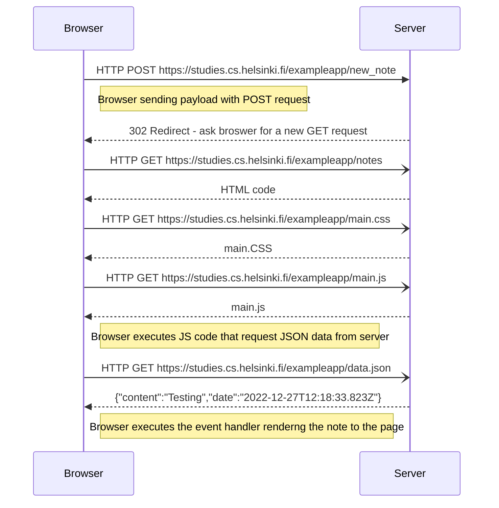

```mermaid
sequenceDiagram
    Browser->>Server: HTTP POST https://studies.cs.helsinki.fi/exampleapp/new_note
    Note right of Browser: Browser sending payload with POST request
    Server-->>Browser: 302 Redirect - ask broswer for a new GET request
    Browser-)Server: HTTP GET https://studies.cs.helsinki.fi/exampleapp/notes
    Server-->>Browser: HTML code
    Browser-)Server: HTTP GET https://studies.cs.helsinki.fi/exampleapp/main.css
    Server-->>Browser: main.CSS
    Browser-)Server: HTTP GET https://studies.cs.helsinki.fi/exampleapp/main.js
    Server-->>Browser: main.js
    Note right of Browser: Browser executes JS code that request JSON data from server
    Browser-)Server: HTTP GET https://studies.cs.helsinki.fi/exampleapp/data.json
    Server-->>Browser: {"content":"Testing","date":"2022-12-27T12:18:33.823Z"}
    Note right of Browser: Browser executes the event handler renderng the note to the page
```
