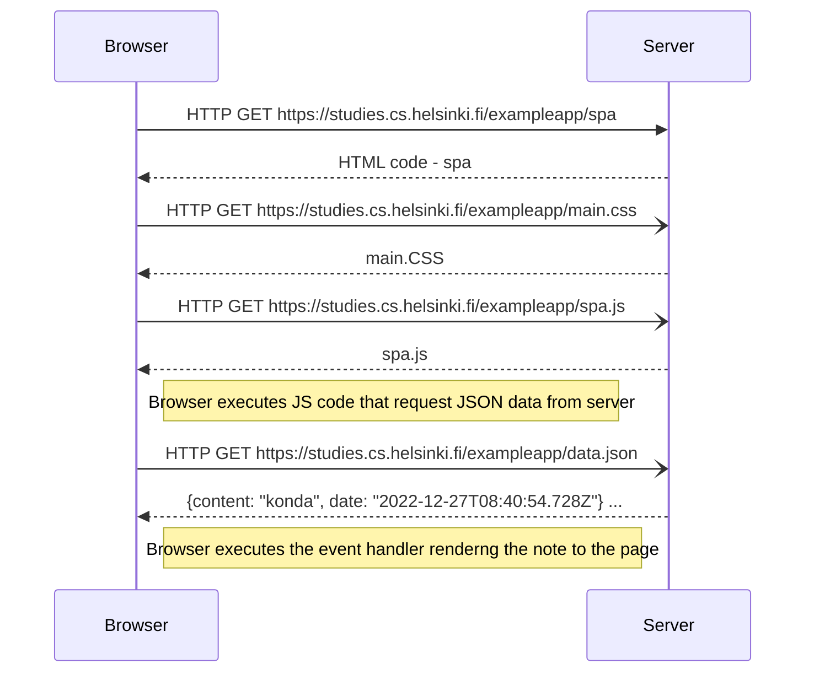

```mermaid
sequenceDiagram
    Browser->>Server: HTTP GET https://studies.cs.helsinki.fi/exampleapp/spa
    Server-->>Browser: HTML code - spa
    Browser-)Server: HTTP GET https://studies.cs.helsinki.fi/exampleapp/main.css
    Server-->>Browser: main.CSS
    Browser-)Server: HTTP GET https://studies.cs.helsinki.fi/exampleapp/spa.js
    Server-->>Browser: spa.js
    Note right of Browser: Browser executes JS code that request JSON data from server
    Browser-)Server: HTTP GET https://studies.cs.helsinki.fi/exampleapp/data.json
    Server-->>Browser: {content: "konda", date: "2022-12-27T08:40:54.728Z"} ...
    Note right of Browser: Browser executes the event handler renderng the note to the page
```
